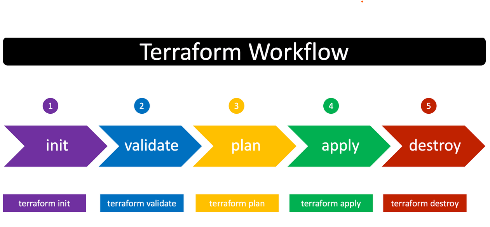
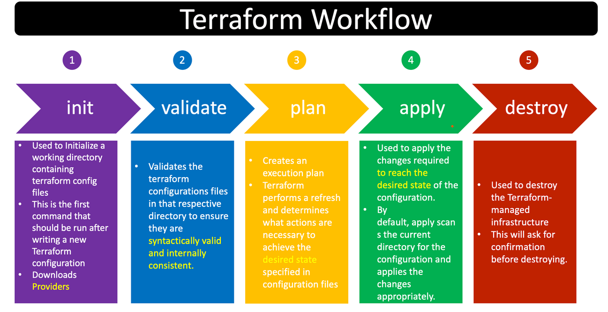

| title | description |
|-------|-------------|
| Terraform Command Basics | Terraform Command Basics |

# Step-01: Introduction

- Understand basic Terraform Commands
  1. terraform init
  2. terraform validate
  3. terraform plan
  4. terraform apply
  5. terraform destroy

# Step-02: Review terraform manifests

- **Pre-Conditions-1:** Get Azure Regions and decide the region where you want to create resources

<pre>
# Get Azure Regions
az account list-locations -o table
</pre>

- **Pre-Conditions-2:** If not done earlier, complete `az login` via Azure CLI. We are going to use Azure CLI Authentication for Terraform when we use Terraform Commands.
<pre>
# Azure CLI Login
 az login

# List Subscriptions
 az account list

# Set Specific Subscription (if we have multiple subscriptions)
 az account set --subscription="SUBSCRIPTION_ID"
</pre>

# Step-03: Terraform Core Commands

<pre>
# Terraform Initialize
terraform init

# Terraform Validate
terraform validate

# Terraform Plan to Verify what it is going to create / update / destroy
terraform plan

# Terraform Apply to Create Resources
terraform apply 
</pre>

# Step-04: Verify Azure Resource Group in Azure Management Console

- Go to Azure Management Console -> Resource Groups
- Verify newly created Resource Group
- Review terraform.tfstate file

# Step-05: Destroy Infrastructure

<pre>
# Destroy Azure Resource Group 
terraform destroy
Observation:
1. Verify if the resource group got deleted in Azure Management Console
2. Verify terraform.tfstate file and resource group info should be removed
3. Verify terraform.tfstate.backup, it should have the resource group info here stored as backup. 

# Delete Terraform files 
rm -rf .terraform*
rm -rf terraform.tfstate*
</pre>
