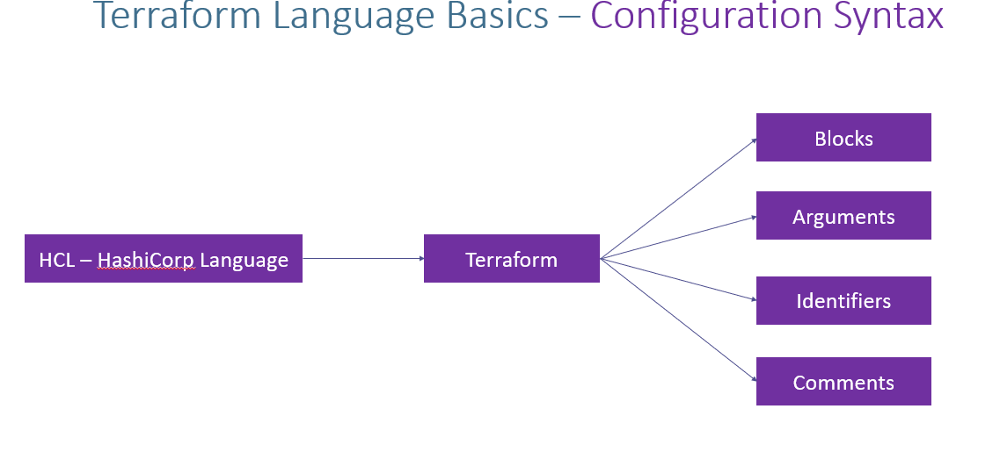
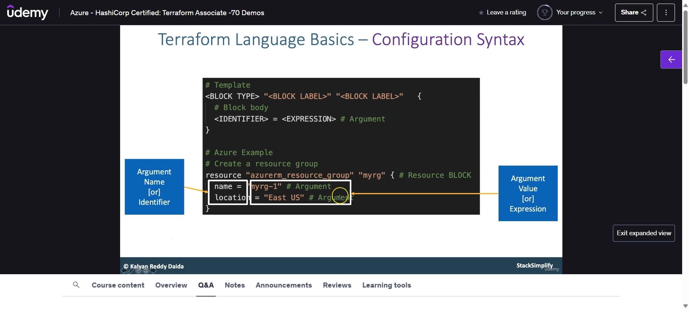
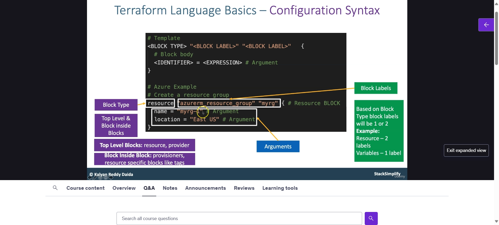

| Title | description |
|-------|-------------|
|Terraform Configuration Language Syntax|Learn Terraform Configuration Language Syntax like Blocks, Arguments, Comments etc|

# Step-01: Introduction

- Understand Blocks
- Understand Arguments
- Understand Identifiers
- Understand Comments

# Step-03: Understand about Arguments, Attributes and Meta-Arguments.

- Arguments can be required or optional(input we provide in BLOCK)
- Attribues format looks like resource_type.resource_name.attribute_name(Output recive  after Resouce Create)
- Meta-Arguments change a resource type's behavior (Example: count, for_each)

# Step-04: Understand about Terraform Top-Level Blocks

- Discuss about Terraform Top-Level blocks

  1.  Terraform Settings Block
  2.  Provider Block
  3.   Resource Block
  4.   Input Variables Block
  5.  Output Values Block
  6.   Local Values Block
  7.  Data Sources Block
  8.   Modules Block

